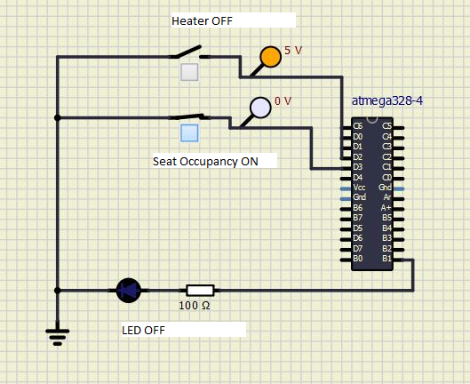
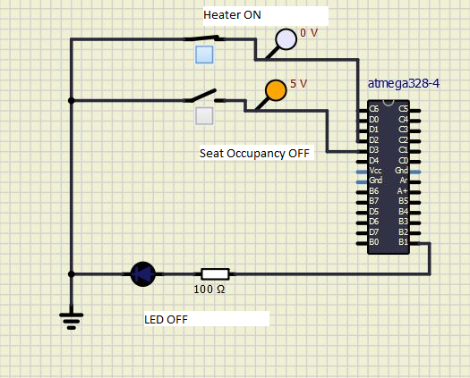
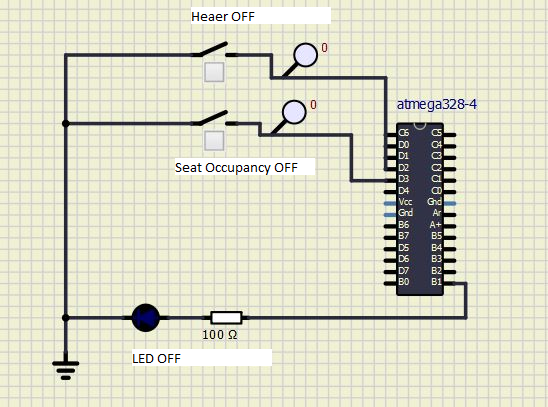
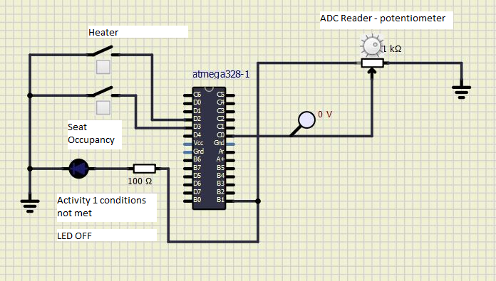
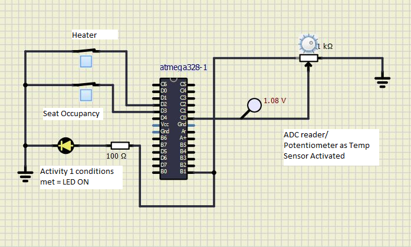
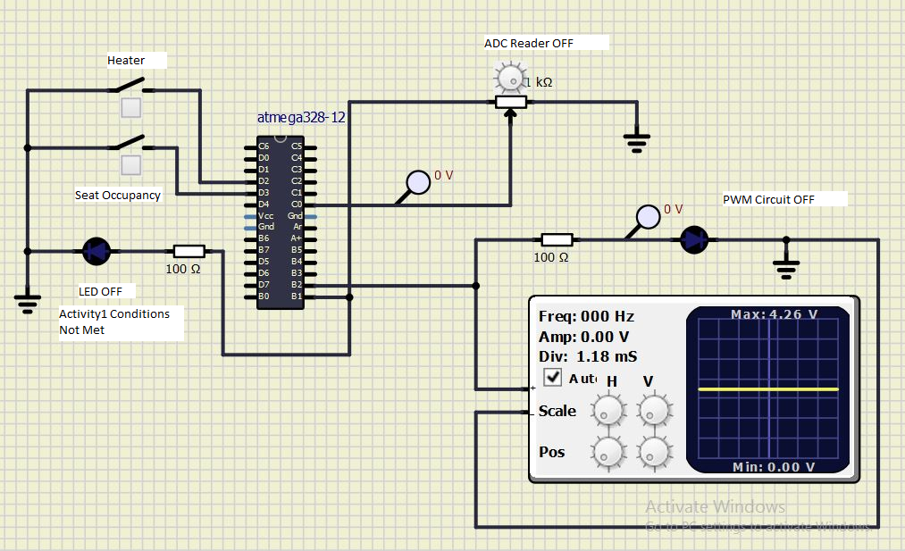
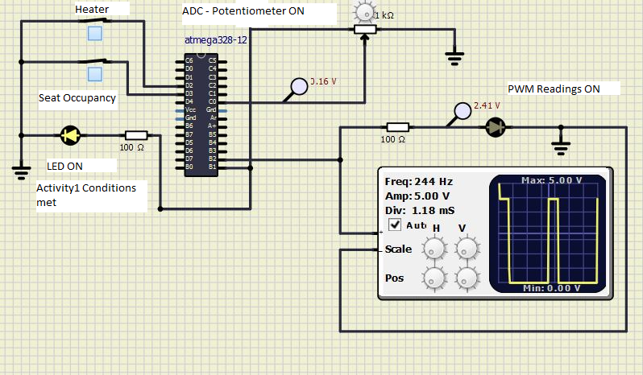

# EmbC_298062
|Build|Cppcheck|Codacy|
||||
## Contributors 

SF ID. |  Name   |     
-------|---------|
`298062` | Amulya Singaraju  |

# Activity 1: LED ON when both Driver's Seat is Occupied and Heater is turned ON
## CASE: LED OFF 
### Case 1: Driver's seat is OCCUPIED, Heater is OFF

### Case 2: Driver's seat is UNOCCUPIED, Heater is ON

### Case 3: Driver's seat is UNOCCUPIED, Heater is OFF

## CASE: LED ON 
### Case 1: Driver's seat is OCCUPIED, Heater is ON

# Activity 2: ADC Reading of Temperature Sensor Using Potentiometer
## CASE: ADC Reader OFF 
### Case 1: When Activity1 Conditions are False

## CASE: ADC Reader ON 
### Case 1: When Activity1 Conditions are True

# Activity 3: PWM Output according to ADC Reading based on Temperature Table
## CASE: PWM Reader OFF 
### Case 1: When Activity1 Conditions are False

## CASE: PWM Reader ON 
### Case 1: When Activity1 Conditions are True

# Activity 4: UART value of Temperature over protocol according to Temperature Table
